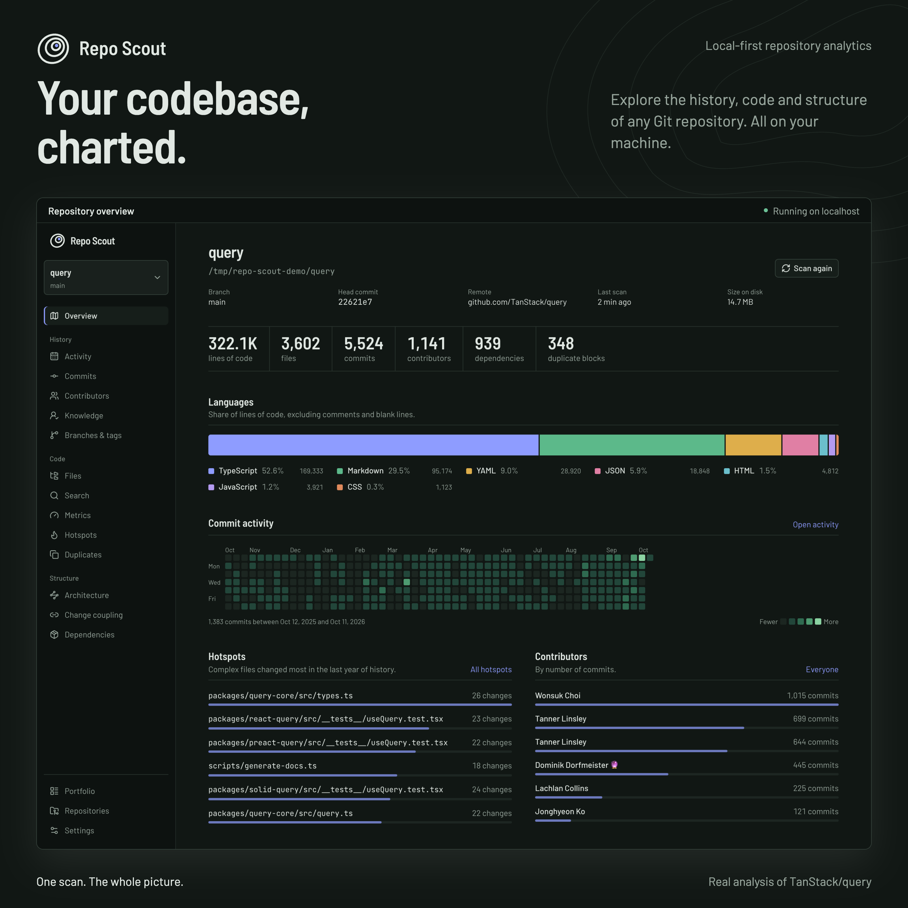
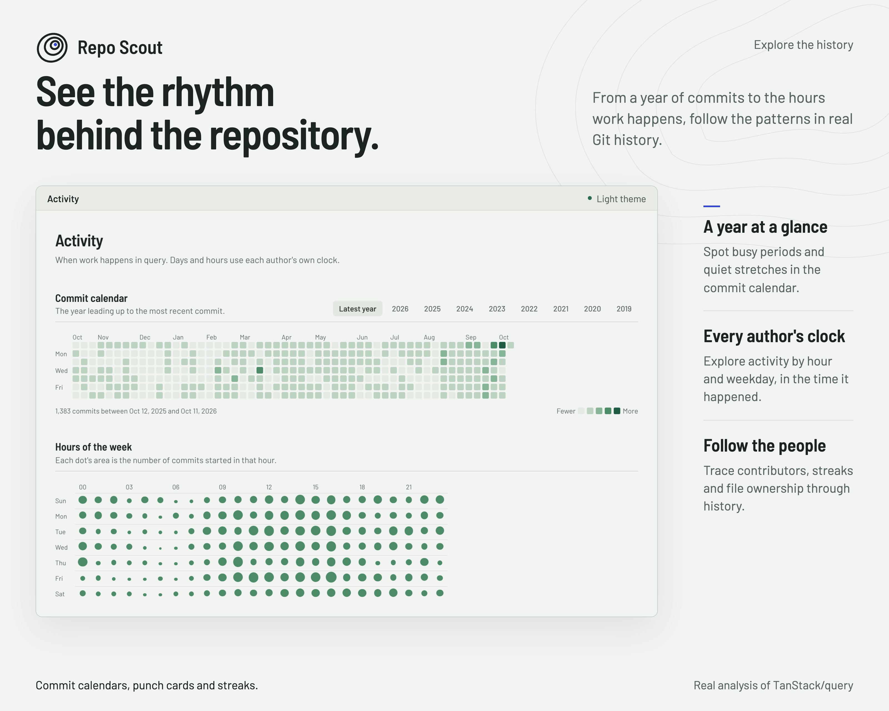
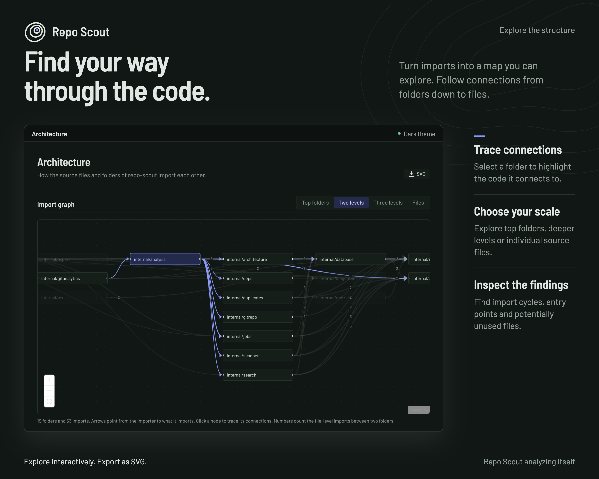
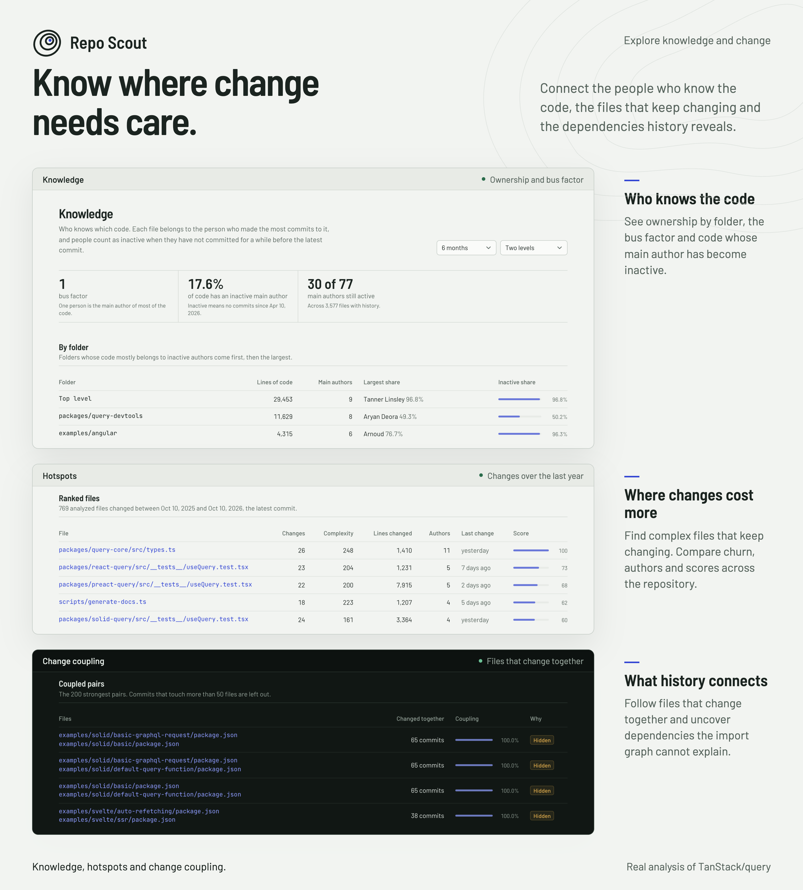

<div align="center">

<picture>
  <source media="(prefers-color-scheme: dark)" srcset="brand/logo-dark.svg" />
  
</picture>

<p><strong>Point it at a folder. See the whole codebase.</strong><br />
Local-first analytics for any Git repository.</p>

<p>
  
  
  
  <a href="LICENSE"></a>
  <a href="https://github.com/KhaledSaeed18/repo-scout/actions/workflows/ci.yml"></a>
  <a href="https://github.com/KhaledSaeed18/repo-scout/releases/latest"></a>
</p>

</div>

Repo Scout scans any Git repository on disk and turns it into an interactive
dashboard: architecture graphs, code quality metrics, dependency trees,
commit history, contributor activity, and duplicate code, all computed
locally and kept in a local SQLite database.

There is no upload step and no account. You give it a path, it walks the
tree and the git log, and the result is a set of pages you can actually
click through instead of a wall of terminal output.

## See it in action

A real scan of [TanStack Query](https://github.com/TanStack/query):
3,602 files, 5,524 commits and 1,141 contributors, explored locally.
Open any image for the full-resolution view.

[](docs/showcase/overview.png)

<details>
<summary>Explore history, architecture, knowledge and change</summary>

### Follow the history

Commit calendars and hour-of-week activity reveal the patterns in TanStack
Query's history, using each author's local clock.

[](docs/showcase/history.png)

### Explore the structure

Repo Scout analyzing itself: select a folder to trace its imports, change
the graph's detail level, and inspect the architecture findings.

[](docs/showcase/structure.png)

### Understand knowledge and change

Three views of TanStack Query: Knowledge maps ownership and bus factor,
Hotspots ranks complex files that keep changing, and Change coupling
reveals files that change together, including hidden dependencies.

[](docs/showcase/insights.png)

</details>

## Why Repo Scout

- **One scan, the whole picture.** Architecture, metrics, dependencies, git
  history, and duplicates all come from a single scan, not five different
  tools with five different output formats to reconcile.
- **It never leaves your machine.** No external APIs, no telemetry, no
  uploading source code anywhere. The Go backend and the SQLite database sit
  on disk; the frontend just talks to `localhost`.
- **Built for real repository sizes.** The scanner streams and batch-inserts
  instead of holding everything in memory, so a 10-file toy project and a
  100k-file monorepo go through the same pipeline.
- **You watch it work, not wait for it.** Every scan is a background job
  broadcasting progress over a WebSocket, with pause / resume / cancel and
  crash recovery, not a frozen progress bar.
- **It tells you what's actually wrong.** Circular imports, dead files,
  unused modules, duplicated blocks with similarity scores, and complexity
  hot spots, surfaced directly, not left for you to infer from a diagram.

## Features

- Repository scanner that handles 10-file projects up to 100k-file monorepos
- Language detection (Go, Rust, Python, Java, Kotlin, TypeScript, JavaScript,
  PHP, C#, C++, C, Swift) with LOC / comments / blank-line breakdown
- Git analytics: commit calendar, hour-of-week punch card, streaks,
  contributors, largest commits, merges, file ownership, branches and tags,
  all on each author's local clock, with identities merged through `.mailmap`
- Dependency graphs (package.json, go.mod, Cargo.toml, pom.xml, composer.json,
  requirements.txt)
- Lazy-loaded file tree with per-file size, complexity and history, plus a
  sortable table of every file, and a local folder picker that marks Git
  repositories
- Instant indexed search: filename, folder, extension, content, regex,
  case-sensitive, whole-word
- Duplicate code detection with similarity scores and linked locations
- Architecture graphs (folder / module / import) with circular dependency
  detection, unused modules, and dead files, exportable as SVG
- Hotspots: complex files that keep changing, over a window you pick
- Knowledge: bus factor, main author per file and folder, and code whose
  main author has gone inactive
- Portfolio: every scanned repository side by side, with size, direction
  since the last scan, bus factor, cycles and hidden dependencies
- Change coupling: files that change together, with hidden dependencies
  (no import, shared package, test or lockfile to explain them) called out
- Metrics: cyclomatic complexity (exact for Go, parsed with the standard
  library; pattern based for other languages), function length, nesting, imports/exports,
  largest and most complex files, and how each headline number moved across past
  scans
- Background jobs with pause / resume / cancel, queue, worker pool, progress,
  and crash recovery
- Live WebSocket updates
- Command line for CI: text, JSON and SARIF reports, quality gates, and a
  comparison against a base ref for pull requests
- CSV/JSON export of files, commits and contributors
- Light, dark, or system theme

## How it works

A scan runs as a background job through ordered stages, each reporting
progress over the WebSocket hub as it goes:

1. **git metadata**: branches, tags, HEAD, remote
2. **file scan**: walk the tree, apply ignore rules and size limits, count
   lines per language, and measure complexity, function length and nesting
   per file with a worker pool
3. **git history**: commits on branches, tags and remotes streamed in
   batches, the files each commit changed (following renames), authors and
   their time zones, contributor rollups and per-file ownership
4. **dependencies**: parse manifests per ecosystem
5. **import graph**: resolve imports, detect cycles (Tarjan SCC), flag
   unused folders and possibly dead files
6. **change coupling**: pair files that keep changing in the same commits,
   skipping sweeping commits, and keep the strongest pairs
7. **duplicates**: shingle-hash normalized lines, cluster similar blocks
8. **content index**: populate SQLite FTS5 for instant search

Heatmaps, streaks and metric rollups are computed from the stored results
when a page asks for them. Jobs are queued, run through a worker pool, and
persist their state: pause, resume, and cancel are state changes, a
repository never runs two scans at once, and a scan interrupted by a crash
is re-queued and starts over on the next launch. A rescan builds its results
on the side and swaps them in only when every stage succeeds, so a cancelled
or failed rescan leaves the previous results untouched. Rescans also reuse
what the last scan learned from history and ask git to diff only the commits
it has not seen, so they get cheaper as history grows.

## Install

Repo Scout is a single binary with the web interface built in. It needs
[Git](https://git-scm.com) on your `PATH` and nothing else.

Download the archive for your system from the
[latest release](https://github.com/KhaledSaeed18/repo-scout/releases/latest)
and unpack it, or let the GitHub CLI pick the latest one:

```sh
# macOS on Apple silicon; use darwin_amd64, linux_amd64, linux_arm64,
# windows_amd64 or windows_arm64 for other systems.
gh release download --repo KhaledSaeed18/repo-scout --pattern '*_darwin_arm64.tar.gz'
tar -xzf repo-scout_*_darwin_arm64.tar.gz
```

The binaries are not code-signed. On macOS, clear the download quarantine
once with `xattr -d com.apple.quarantine repo-scout`; on Windows, choose
**More info**, then **Run anyway** the first time.

To check a download, compare it against `checksums.txt` from the same release
and verify the build provenance signed by the release workflow:

```sh
gh attestation verify repo-scout_*_darwin_arm64.tar.gz --repo KhaledSaeed18/repo-scout
```

Each release also lists an SPDX software bill of materials per archive.

**Command line only.** For CI, the command line can be installed with Go 1.26
or newer; it has every command, without the web interface:
`go install github.com/KhaledSaeed18/repo-scout/cmd/repo-scout@latest`.

**Container.** No image is published. To run Repo Scout in a container,
build one from the [`Dockerfile`](Dockerfile) and mount the folders to scan
read-only:

```sh
docker build -t repo-scout .
docker run --rm -p 127.0.0.1:8080:8080 \
  -v repo-scout-data:/data -v "$HOME/code:/repos:ro" repo-scout
```

Publish the port on `127.0.0.1` as shown; the API has no authentication.

## Quick start

1. Run `repo-scout` (`repo-scout.exe` on Windows). It serves the interface at
   http://localhost:8080.
2. Open **Repositories**, pick or paste the folder of a Git repository, and
   start the scan. Progress shows live; a scan of a few thousand files and
   commits takes seconds.
3. Explore the pages in the sidebar. Scan again whenever the code changes;
   every scan is kept, so **Metrics** shows how the numbers move.

Stop the server with Ctrl+C. Run `repo-scout --help` for the commands.

### Configuration

Repo Scout is configured through environment variables; preferences such as
ignored folders, limits and the theme are edited on the **Settings** page.

| Variable | Default | Meaning |
| --- | --- | --- |
| `REPO_SCOUT_ADDR` | `127.0.0.1:8080` | Where the server listens; `repo-scout serve --addr` overrides it. Keep it on loopback. |
| `REPO_SCOUT_DB` | `repo-scout/reposcout.db` in the user configuration folder | The SQLite database with every scan; `--db` overrides it. |
| `REPO_SCOUT_ALLOWED_HOSTS` | (none) | Extra host names the server answers to, comma separated, for example behind a container or tunnel. |
| `REPO_SCOUT_LOG_LEVEL` | `info` | `debug`, `info`, `warn` or `error`. |
| `REPO_SCOUT_LOG_FORMAT` | `text` | `text`, or `json` for log collectors. |

The user configuration folder is `~/Library/Application Support` on macOS,
`~/.config` on Linux and `%AppData%` on Windows.

## Use it in CI

`repo-scout scan` analyzes a folder without a server and prints a report as
text, JSON or [SARIF](https://sarifweb.azurewebsites.net/). Quality gates make
it exit with status 1, so a pipeline can block on them:

```sh
repo-scout scan . \
  --max-complexity 150 \
  --max-duplicates 20 \
  --fail-on cycles,hidden-coupling
```

| Flag | Meaning |
| --- | --- |
| `--format text\|json\|sarif` | Report format (default `text`) |
| `--output file` | Write the report to a file instead of standard output |
| `--top n` | How many hotspots, duplicates and hidden dependencies to list (default 10) |
| `--max-complexity n` | Fail when any file's total complexity is above `n` |
| `--max-duplicates n` | Fail when there are more than `n` duplicate groups |
| `--fail-on cycles,hidden-coupling` | Fail on any circular dependency or hidden dependency |
| `--base ref` | Also report what changed against `ref` (such as `origin/main`): files added and removed, complexity moves, new and resolved cycles, dependency changes |
| `--max-complexity-increase n` | With `--base`, fail when total complexity grew by more than `n` |
| `--fail-on new-cycles` | With `--base`, fail only on circular dependencies the base did not have |
| `--quiet` | No progress on standard error |

Exit codes: `0` passed, `1` a quality gate failed, `2` bad usage, `3` the scan
failed. In GitHub Actions, the SARIF report shows findings in the code
scanning tab and on pull requests:

```yaml
jobs:
  repo-scout:
    runs-on: ubuntu-latest
    permissions:
      contents: read
      security-events: write
    steps:
      - uses: actions/checkout@v4
        with:
          fetch-depth: 0 # hotspots, knowledge and coupling read the history
      - uses: actions/setup-go@v5
        with:
          go-version: stable
      # Pin the version you have tested.
      - run: go install github.com/KhaledSaeed18/repo-scout/cmd/repo-scout@v1.0.0
      - run: repo-scout scan . --format sarif --output repo-scout.sarif --fail-on cycles
        if: github.event_name == 'push'
      # On pull requests, judge the change rather than the whole codebase.
      - run: >
          repo-scout scan . --format sarif --output repo-scout.sarif
          --base origin/${{ github.base_ref }} --fail-on new-cycles --max-complexity-increase 50
        if: github.event_name == 'pull_request'
      - uses: github/codeql-action/upload-sarif@v3
        if: always()
        with:
          sarif_file: repo-scout.sarif
          category: repo-scout
```

## API

Everything the interface does goes through a local JSON API, described in
[`internal/api/openapi.yaml`](internal/api/openapi.yaml) and served by a
running instance at http://localhost:8080/api/openapi.yaml. Scripts can use
it to add repositories, start scans and read every result.

## Versioning

Repo Scout follows [Semantic Versioning](https://semver.org). Its public
interface is:

- the command line: commands, flags, exit codes and environment variables;
- the `scan` reports: the JSON fields and the SARIF rule IDs;
- the HTTP API as described in `internal/api/openapi.yaml`.

Within a major version these only gain additions. Anything else, including
the database layout and the look of the interface, may change in any
release. Every change is recorded in the [changelog](CHANGELOG.md).

### Upgrading

Replace the binary and start it again. The database is migrated forward
automatically on start; it cannot be opened by an older version afterwards,
so copy the `reposcout.db` file first if you may want to go back. Results
from earlier scans stay readable, and a rescan fills in anything a new
version adds.

## Build from source

Building needs Go 1.26+, Node 22.13+ with pnpm 11+, Git and Make:

```sh
git clone https://github.com/KhaledSaeed18/repo-scout.git
cd repo-scout
(cd frontend && pnpm install)
make build          # bin/repo-scout with the interface embedded
./bin/repo-scout
```

For development, `make dev` runs the API with a hot-reloading interface at
http://localhost:5173 and keeps its database in `data/`.

| Command | What it does |
| --- | --- |
| `make dev` | API and frontend together, with hot reload |
| `make build` | One `bin/repo-scout` binary with the interface embedded |
| `make check` | Everything CI checks except the browser tests |
| `make test` | Go tests, then frontend typecheck and unit tests |
| `make e2e` | Playwright end-to-end tests against the built binary |
| `make lint` | `go vet`, golangci-lint and oxlint |
| `make backend` / `make frontend` | Only the API, or only the Vite dev server |

## Architecture

```
repo-scout/
├── cmd/repo-scout/        # composition root (thin)
├── internal/
│   ├── config/            # settings, env/flags, defaults, ignore rules
│   ├── models/             # GORM models (db schema)
│   ├── database/          # SQLite connection + migrations + indexes
│   ├── langdetect/         # language detection + LOC counting
│   ├── scanner/            # filesystem walker (files, folders, sizes)
│   ├── gitrepo/            # git history analysis (CLI-backed)
│   ├── deps/               # dependency manifest parsers
│   ├── metrics/            # complexity + structural metrics
│   ├── duplicates/         # similarity / duplicate block detection
│   ├── architecture/       # import graphs, cycles, unused/dead files
│   ├── search/             # indexed search (filename/folder/ext/content/regex)
│   ├── analysis/           # orchestrates a scan pipeline (stages)
│   ├── jobs/               # background job queue, worker pool, pause/resume/cancel
│   ├── ws/                 # WebSocket hub + event bus
│   ├── risk/               # hotspots and knowledge concentration
│   ├── coupling/           # files that change together
│   ├── portfolio/          # every scanned repository side by side
│   ├── report/             # CLI reports (text, JSON, SARIF) and quality gates
│   ├── api/                # chi router, HTTP handlers, REST + WS endpoints
│   ├── webui/              # the built frontend, embedded in release builds
│   └── export/             # CSV/JSON exporters
├── frontend/               # React + Vite + TS + Tailwind + shadcn/ui
├── brand/                  # logo, icons and social preview sources
└── scripts/dev.sh          # single-command run
```

| Concern         | Choice                                          |
|-----------------|--------------------------------------------------|
| Backend         | Go (chi router)                                   |
| Database        | SQLite via GORM, FTS5 for content search          |
| Git parsing     | `git` CLI via `os/exec`, cached in SQLite         |
| Background jobs | Custom job manager (queue + pool + persistence)   |
| Real time       | gorilla/websocket hub                             |
| Frontend        | React + Vite + TypeScript + Tailwind + shadcn/ui  |
| Data fetching   | TanStack Query                                    |
| Graphs          | React Flow                                        |
| Charts          | Plain SVG and CSS (calendar, punch card, strata)  |

## Contributing

Bug reports, ideas and pull requests are welcome. Notable changes are
listed in the [changelog](CHANGELOG.md). The
[contributing guide](CONTRIBUTING.md) covers setup, how the scan pipeline and
frontend fit together, the conventions the code follows, and step-by-step
guides for adding languages, manifest formats and pages. Everyone taking part
is expected to follow the [code of conduct](CODE_OF_CONDUCT.md).

Found a security problem? Please report it privately as described in the
[security policy](SECURITY.md).

## License

Repo Scout is released under the [MIT License](LICENSE).
